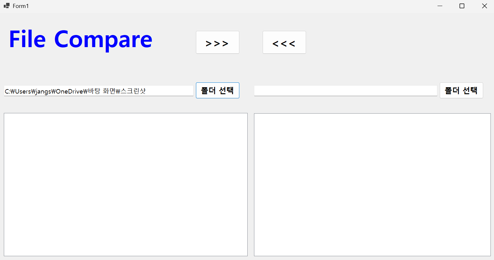
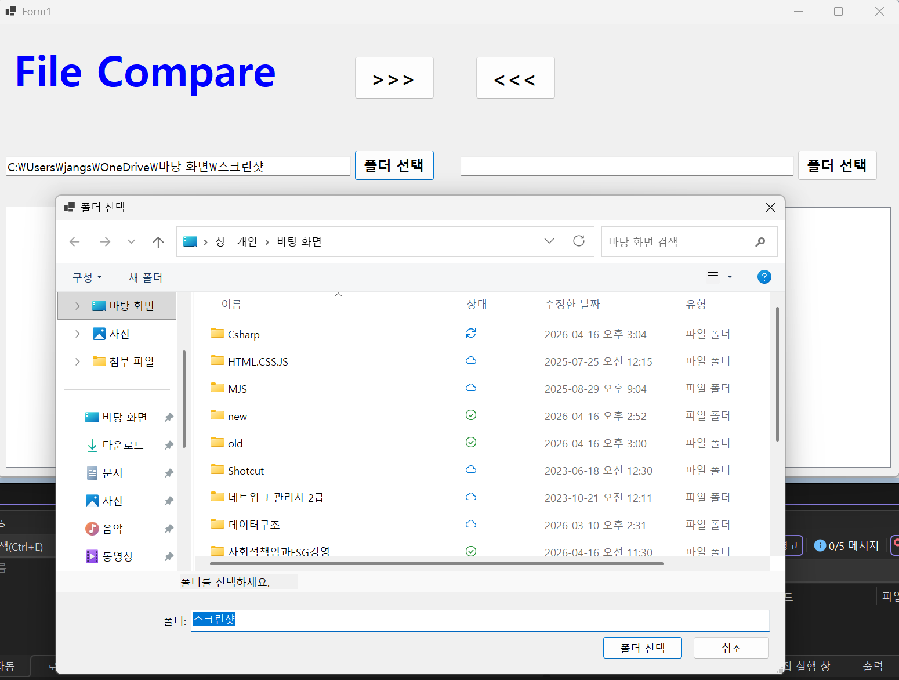

# (C# 코딩) 파일 비교 툴

## 개요
- C# 프로그래밍 학습
- 1줄 소개: 두 폴더의 파일들을 비교해서 상호 복사하는 프로그램
- 사용한 플랫폼:
	- C#, .NET Windows Forms, Visual Studio, GitHub
- 사용한 컨트롤:
	- Label, TextBox, ListBox, Button, SplitContainer, Panel
- 사용한 기술과 구현한 기능:
	- Visual Studio를 이용하여 UI 디자인
	- 컨트롤 배치와 기본적인 속성 설정
	- 컨트롤 이름 정하기

## 실행 화면 (과제1)
- 코드의 실행 스크린샷과 구현 내용 설명

- 구현한 내용 (위 그림 참조)
	-  UI 구성: GUI 설계 및 컨트롤 배치
	- 컨트롤의 기본 기능 확인과 구현: 컨트롤에서 기본적으로 제공하는 기능 구동 확인, 다시 주문할 수 있도록 초기화